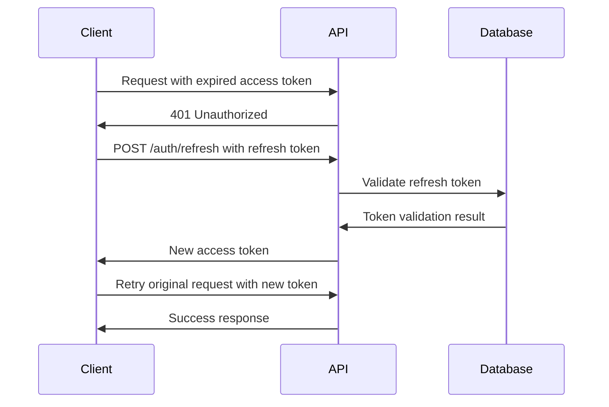

# VenueKart Technical Documentation 📚

This document provides comprehensive technical documentation for the VenueKart venue booking platform, detailing the architecture, implementation, and functionality of every component in the system.

## 📋 Table of Contents

1. [Project Overview](#project-overview)
2. [Architecture Overview](#architecture-overview)
3. [Frontend Documentation](#frontend-documentation)
4. [Backend Documentation](#backend-documentation)
5. [Database Schema](#database-schema)
6. [API Documentation](#api-documentation)
7. [Authentication & Authorization](#authentication--authorization)
8. [File Upload & Image Management](#file-upload--image-management)
9. [Email System](#email-system)
10. [Deployment & Configuration](#deployment--configuration)
11. [Development Guidelines](#development-guidelines)

---

## 📁 Project Overview

VenueKart is a full-stack venue booking platform built with React and Express.js, featuring a modern SPA frontend and a RESTful API backend with MySQL database integration.

### Technology Stack Summary

**Frontend**: React 18, Vite, TailwindCSS, Radix UI, Framer Motion, React Router 6  
**Backend**: Node.js, Express.js, MySQL, JWT, Cloudinary, Nodemailer  
**Development**: TypeScript, Vitest, Prettier, Concurrently  
**Deployment**: Netlify (frontend), Railway/Heroku (backend), PlanetScale (database)

---

## 🏗️ Architecture Overview

```
┌─────────────────┐    ┌─────────────────┐    ┌─────────────────┐
│                 │    │                 │    │                 │
│   React SPA     │◄──►│  Express API    │◄──►│  MySQL Database │
│   (Port 8080)   │    │   (Port 5000)   │    │                 │
│                 │    │                 │    │                 │
└─────────────────┘    └─────────────────┘    └─────────────────┘
         │                       │                       │
         ▼                       ▼                       ▼
┌─────────────────┐    ┌─────────────────┐    ┌─────────────────┐
│                 │    │                 │    │                 │
│  TailwindCSS    │    │   Cloudinary    │    │   Email SMTP    │
│  Radix UI       │    │   (Images)      │    │   (Nodemailer)  │
│                 │    │                 │    │                 │
└────��────────────┘    └─────────────────┘    └─────────────────┘
```

### Request Flow
1. **Client Request**: React SPA sends authenticated requests
2. **API Processing**: Express middleware validates JWT tokens
3. **Database Operations**: MySQL queries with connection pooling
4. **External Services**: Cloudinary for images, SMTP for emails
5. **Response**: JSON data returned to client

---

## 🎯 Frontend Documentation

### 📄 Application Entry Point

#### `client/App.jsx`
**Purpose**: Main application component with routing and global providers

```javascript
// Key Features:
- React Router 6 configuration
- Global context providers (Auth, Query Client)
- Error boundary integration
- Toast notification system
- Tooltip provider setup
```

**Route Structure**:
- **Public Routes**: `/`, `/venues`, `/venue/:id`, `/about`, `/contact`
- **Auth Routes**: `/signin`, `/signup`, `/verify-otp`, `/forgot-password`
- **Protected Routes**: `/dashboard`, `/favorites`, `/admin/*`
- **Catch-all**: `*` → NotFound component

#### `client/global.css`
**Purpose**: Global styles, theme system, and TailwindCSS configuration

```css
/* Key Features: */
- Google Fonts integration (Poppins, Inter)
- CSS custom properties for theming
- Light/dark mode support
- VenueKart brand colors
- Responsive design tokens
```

**Theme Variables**:
```css
:root {
  --primary: 244 62% 32%;     /* venue-indigo */
  --accent: 246 100% 69%;     /* venue-purple */
  --secondary: 246 100% 95%;  /* venue-lavender */
  --background: 0 0% 100%;    /* white */
}
```

### 📁 Pages Directory (`client/pages/`)

#### Core Pages

##### `client/pages/Index.jsx`
**Purpose**: Homepage with hero section, features, and venue showcase

**Key Components**:
- **Hero Section**: Background image with search form
- **Search Form**: Location and venue type inputs with live search
- **Feature Cards**: Platform benefits with icons and animations
- **Popular Venues**: API-driven venue cards with favorites integration
- **How It Works**: Step-by-step process explanation

**API Integration**:
```javascript
// Loads popular venues on mount
const loadPopularVenues = async () => {
  const data = await apiCall('/api/venues?limit=3');
  // Formats data for display with fallback images
};
```

##### `client/pages/Venues.jsx`
**Purpose**: Venue listing page with advanced search and filtering

**Features**:
- Advanced search form with location, venue type, capacity filters
- Pagination with limit/offset
- Sort options (price, rating, capacity)
- Real-time search with URL parameter sync
- Loading states and error handling

##### `client/pages/VenueDetail.jsx`
**Purpose**: Individual venue details with booking functionality

**Components**:
- **Image Gallery**: Cloudinary images with navigation
- **Venue Information**: Name, location, capacity, pricing
- **Facilities Display**: Amenity badges and features
- **Booking Form**: Date selection, guest count, special requirements
- **Owner Contact**: Contact information (post-acceptance)

##### `client/pages/AdminDashboard.jsx`
**Purpose**: Comprehensive dashboard for venue owners

**Dashboard Sections**:
- **Overview**: Revenue stats, booking counts, recent activity
- **Venue Management**: CRUD operations for venues
- **Booking Management**: Inquiry handling with status updates
- **Notifications**: Real-time booking alerts with email integration
- **Analytics**: Revenue tracking and performance metrics

**Real-time Features**:
```javascript
// Auto-refresh booking data every 30 seconds
useEffect(() => {
  const interval = setInterval(loadBookings, 30000);
  return () => clearInterval(interval);
}, []);
```

##### `client/pages/UserDashboard.jsx`
**Purpose**: Customer dashboard for booking management

**Features**:
- Booking history with status tracking
- Profile management interface
- Notification center
- Favorites management integration

#### Authentication Pages

##### `client/pages/SignIn.jsx`
**Purpose**: User authentication with multiple login options

**Authentication Methods**:
- **Email/Password**: Traditional login with validation
- **Google OAuth**: Social login with popup integration
- **Session Management**: Token storage and refresh handling

##### `client/pages/SignUp.jsx`
**Purpose**: User registration with email verification

**Registration Flow**:
1. User type selection (customer/venue-owner)
2. Form submission with validation
3. Email verification via OTP
4. Account activation and token issuance

##### `client/pages/VerifyOTP.jsx`
**Purpose**: Email verification interface

**Features**:
- 6-digit OTP input with auto-focus
- Resend OTP functionality with cooldown
- Auto-navigation on successful verification
- Error handling for invalid/expired codes

### 📁 Components Directory (`client/components/`)

#### Core Components

##### `client/components/Navigation.jsx`
**Purpose**: Site navigation with authentication state

**Features**:
- Responsive navigation menu
- Authentication-based menu items
- Mobile hamburger menu
- User avatar dropdown
- Active link highlighting

**Authentication Integration**:
```javascript
// Shows different menu items based on auth state
{isLoggedIn ? (
  <UserDropdown user={user} />
) : (
  <AuthLinks />
)}
```

##### `client/components/Footer.jsx`
**Purpose**: Site footer with links and company information

**Sections**:
- Company information and logo
- Quick navigation links
- Legal links (Privacy, Terms)
- Social media integration
- Contact information

##### `client/components/AddVenueForm.jsx`
**Purpose**: Multi-step venue creation form

**Form Steps**:
1. **Basic Info**: Name, description, location
2. **Details**: Capacity, pricing, venue type
3. **Images**: Multiple image upload with preview
4. **Facilities**: Amenity selection with checkboxes

**Image Upload Integration**:
```javascript
// Converts files to base64 and uploads to Cloudinary
const handleImageUpload = async (files) => {
  const base64Images = await Promise.all(
    files.map(file => convertToBase64(file))
  );
  const response = await fetch('/api/upload/images', {
    method: 'POST',
    body: JSON.stringify({ images: base64Images })
  });
};
```

##### `client/components/EditVenueForm.jsx`
**Purpose**: Venue editing form with existing data pre-population

**Features**:
- Pre-populated form fields from API data
- Image management (add/remove existing images)
- Facility updates with real-time preview
- Form validation with error states

##### `client/components/TokenExpiredNotice.jsx`
**Purpose**: Session expiration notification

**Features**:
- Auto-redirect countdown timer
- Manual refresh and sign-in options
- Modal overlay with user-friendly messaging
- Integration with authentication context

#### UI Components (`client/components/ui/`)

##### Form Components

**`client/components/ui/input.jsx`**
- Styled input with focus states and validation
- Forward ref support for form libraries
- Error state styling and accessibility

**`client/components/ui/button.jsx`**
- Multiple variants (primary, secondary, ghost, destructive)
- Size variations (sm, md, lg, icon)
- Loading states with spinner integration
- Icon support and accessibility features

**`client/components/ui/textarea.jsx`**
- Multi-line text input with auto-resize
- Character count and validation support
- Consistent styling with input components

##### Display Components

**`client/components/ui/card.jsx`**
- Flexible container with header, content, footer
- Hover effects and elevation shadows
- Multiple variants (elevated, outlined, interactive)

**`client/components/ui/badge.jsx`**
- Status indicators with color variants
- Size variations and icon support
- Semantic meaning (success, warning, error, info)

**`client/components/ui/avatar.jsx`**
- User profile images with fallback initials
- Multiple sizes and loading states
- Accessibility compliance

##### Interactive Components

**`client/components/ui/dialog.jsx`**
- Modal dialogs with backdrop and focus management
- Accessibility (ARIA, focus trap, ESC key)
- Animation transitions and portal rendering

**`client/components/ui/popover.jsx`**
- Floating content containers with positioning
- Click outside to close functionality
- Keyboard navigation support

**`client/components/ui/select.jsx`**
- Dropdown selection with search capability
- Multiple selection and custom option rendering
- Keyboard navigation and accessibility

##### Feedback Components

**`client/components/ui/alert.jsx`**
- Alert messages with multiple variants
- Icon integration and dismissible functionality
- Accessibility features and screen reader support

**`client/components/ui/toaster.jsx`**
- Toast notification system with queue management
- Auto-dismiss functionality and positioning
- Animation transitions and z-index management

### 📁 Contexts (`client/contexts/`)

#### `client/contexts/AuthContext.jsx`
**Purpose**: Global authentication state management

**State Management**:
```javascript
const AuthContext = {
  user: null,              // Current user object
  isLoggedIn: false,       // Authentication status
  loading: true,           // Initial load state
  login,                   // Login function
  logout,                  // Logout function
  register,                // Registration function
  verifyOTP,              // Email verification
  loginWithGoogle         // OAuth function
};
```

**Token Management**:
- Access token storage in localStorage
- Automatic token refresh on expiration
- Token cleanup on logout
- Session persistence across browser restarts

### 📁 Hooks (`client/hooks/`)

#### `client/hooks/useFavorites.js`
**Purpose**: Custom hook for favorites management

**API Integration**:
```javascript
const useFavorites = () => {
  const [favoriteIds, setFavoriteIds] = useState(new Set());
  
  const addToFavorites = async (venueId) => {
    await fetch(`/api/favorites/${venueId}`, { method: 'POST' });
    setFavoriteIds(prev => new Set([...prev, venueId]));
  };
  
  const removeFromFavorites = async (venueId) => {
    await fetch(`/api/favorites/${venueId}`, { method: 'DELETE' });
    setFavoriteIds(prev => {
      const updated = new Set(prev);
      updated.delete(venueId);
      return updated;
    });
  };
  
  return { favoriteIds, addToFavorites, removeFromFavorites, toggleFavorite, isFavorite };
};
```

### ��� Services (`client/services/`)

#### `client/services/authService.js`
**Purpose**: Authentication API service layer

**Key Functions**:
```javascript
// Login with email/password
export const login = async (email, password) => {
  const response = await fetch('/api/auth/login', {
    method: 'POST',
    headers: { 'Content-Type': 'application/json' },
    body: JSON.stringify({ email, password })
  });
  return response.json();
};

// Google OAuth login
export const loginWithGoogle = () => {
  return new Promise((resolve, reject) => {
    const popup = window.open('/api/auth/google', 'google-login', 'width=500,height=600');
    // Handle popup messaging and token extraction
  });
};

// Token refresh
export const refreshAccessToken = async () => {
  const refreshToken = localStorage.getItem('refreshToken');
  const response = await fetch('/api/auth/refresh', {
    method: 'POST',
    headers: { 'Content-Type': 'application/json' },
    body: JSON.stringify({ refreshToken })
  });
  return response.json();
};
```

#### `client/services/venueService.js`
**Purpose**: Venue-related API operations

**CRUD Operations**:
```javascript
// Get all venues with filtering
export const getVenues = async (filters = {}) => {
  const params = new URLSearchParams(filters);
  const response = await fetch(`/api/venues?${params}`);
  return response.json();
};

// Create new venue
export const createVenue = async (venueData) => {
  const response = await apiClient.post('/api/venues', venueData);
  return response.json();
};

// Update venue
export const updateVenue = async (venueId, venueData) => {
  const response = await apiClient.put(`/api/venues/${venueId}`, venueData);
  return response.json();
};
```

### 📁 Library (`client/lib/`)

#### `client/lib/apiClient.js`
**Purpose**: Centralized HTTP client with automatic token management

**Features**:
- Automatic JWT token attachment
- Token refresh on 401 responses
- Request queuing during token refresh
- Error handling and retry logic

```javascript
class ApiClient {
  constructor() {
    this.isRefreshing = false;
    this.failedQueue = [];
  }

  async request(url, options = {}) {
    let token = localStorage.getItem('accessToken');
    
    // Attach authorization header
    options.headers = {
      ...options.headers,
      'Authorization': `Bearer ${token}`
    };

    let response = await fetch(url, options);

    // Handle token expiration
    if (response.status === 401 && !this.isRefreshing) {
      return this.handleTokenRefresh(url, options);
    }

    return response;
  }

  async handleTokenRefresh(originalUrl, originalOptions) {
    if (this.isRefreshing) {
      // Queue the request
      return new Promise((resolve, reject) => {
        this.failedQueue.push({ resolve, reject, url: originalUrl, options: originalOptions });
      });
    }

    this.isRefreshing = true;
    
    try {
      const newToken = await refreshAccessToken();
      localStorage.setItem('accessToken', newToken);
      
      // Process queued requests
      this.processQueue(null, newToken);
      
      // Retry original request
      return this.request(originalUrl, originalOptions);
    } catch (error) {
      this.processQueue(error, null);
      throw error;
    } finally {
      this.isRefreshing = false;
    }
  }
}
```

#### `client/lib/utils.js`
**Purpose**: Utility functions for common operations

```javascript
// Class name merging utility (clsx + tailwind-merge)
export function cn(...inputs) {
  return twMerge(clsx(inputs));
}

// Date formatting helpers
export const formatDate = (date) => {
  return new Intl.DateTimeFormat('en-US', {
    year: 'numeric',
    month: 'long',
    day: 'numeric'
  }).format(new Date(date));
};

// Currency formatting
export const formatCurrency = (amount) => {
  return new Intl.NumberFormat('en-IN', {
    style: 'currency',
    currency: 'INR'
  }).format(amount);
};
```

---

## ⚙️ Backend Documentation

### 📄 Server Entry Points

#### `server/index.js`
**Purpose**: Main Express application factory

```javascript
export function createServer() {
  const app = express();

  // Initialize database tables
  initializeDatabase();

  // Middleware setup
  app.use(cors({ origin: process.env.FRONTEND_URL, credentials: true }));
  app.use(express.json());
  app.use(express.urlencoded({ extended: true }));
  
  // Session and Passport setup
  app.use(session({ secret: process.env.COOKIE_SECRET }));
  app.use(passport.initialize());
  app.use(passport.session());

  // Route mounting
  app.use("/api/auth", authRoutes);
  app.use("/api/venues", venuesRoutes);
  app.use("/api/bookings", bookingsRoutes);
  app.use("/api/upload", uploadRoutes);
  app.use("/api/favorites", favoritesRoutes);

  return app;
}
```

#### `server/dev-server.js`
**Purpose**: Development server with database initialization

```javascript
// Load environment variables
dotenv.config();

// Initialize database and start server
const startServer = async () => {
  console.log('Starting database initialization...');
  await initializeDatabase();
  
  const app = createServer();
  const PORT = process.env.PORT || 5000;
  
  app.listen(PORT, () => {
    console.log(`Express server running on port ${PORT}`);
  });
};
```

### 📁 Configuration (`server/config/`)

#### `server/config/database.js`
**Purpose**: Database connection and schema management

**Connection Pool Setup**:
```javascript
import mysql from 'mysql2/promise';

const pool = mysql.createPool({
  host: process.env.DB_HOST || 'localhost',
  user: process.env.DB_USER || 'root',
  password: process.env.DB_PASSWORD || '',
  database: process.env.DB_NAME || 'venuekart',
  waitForConnections: true,
  connectionLimit: 10,
  queueLimit: 0
});
```

**Database Schema**:

**Users Table**:
```sql
CREATE TABLE users (
  id INT PRIMARY KEY AUTO_INCREMENT,
  google_id VARCHAR(255),
  email VARCHAR(255) UNIQUE NOT NULL,
  name VARCHAR(255) NOT NULL,
  password_hash VARCHAR(255),
  profile_picture TEXT,
  mobile_number VARCHAR(20),
  business_name VARCHAR(255),
  location VARCHAR(255),
  user_type ENUM('customer', 'venue-owner') DEFAULT 'customer',
  is_verified BOOLEAN DEFAULT FALSE,
  created_at TIMESTAMP DEFAULT CURRENT_TIMESTAMP,
  updated_at TIMESTAMP DEFAULT CURRENT_TIMESTAMP ON UPDATE CURRENT_TIMESTAMP
);
```

**Venues Table**:
```sql
CREATE TABLE venues (
  id INT PRIMARY KEY AUTO_INCREMENT,
  owner_id INT NOT NULL,
  name VARCHAR(255) NOT NULL,
  description TEXT,
  location VARCHAR(255) NOT NULL,
  capacity INT NOT NULL,
  price_per_day DECIMAL(10, 2),
  price_min DECIMAL(10, 2),
  price_max DECIMAL(10, 2),
  status ENUM('active', 'inactive') DEFAULT 'active',
  rating DECIMAL(3, 2) DEFAULT 0.00,
  total_bookings INT DEFAULT 0,
  created_at TIMESTAMP DEFAULT CURRENT_TIMESTAMP,
  updated_at TIMESTAMP DEFAULT CURRENT_TIMESTAMP ON UPDATE CURRENT_TIMESTAMP,
  FOREIGN KEY (owner_id) REFERENCES users(id) ON DELETE CASCADE
);
```

**Bookings Table**:
```sql
CREATE TABLE bookings (
  id INT PRIMARY KEY AUTO_INCREMENT,
  venue_id INT NOT NULL,
  customer_id INT NOT NULL,
  customer_name VARCHAR(255) NOT NULL,
  customer_email VARCHAR(255) NOT NULL,
  customer_phone VARCHAR(20),
  event_date DATE NOT NULL,
  event_type VARCHAR(100),
  guest_count INT NOT NULL,
  amount DECIMAL(10, 2),
  status ENUM('pending', 'confirmed', 'cancelled') DEFAULT 'pending',
  special_requirements TEXT,
  booking_date TIMESTAMP DEFAULT CURRENT_TIMESTAMP,
  created_at TIMESTAMP DEFAULT CURRENT_TIMESTAMP,
  updated_at TIMESTAMP DEFAULT CURRENT_TIMESTAMP ON UPDATE CURRENT_TIMESTAMP,
  FOREIGN KEY (venue_id) REFERENCES venues(id) ON DELETE CASCADE,
  FOREIGN KEY (customer_id) REFERENCES users(id) ON DELETE CASCADE
);
```

### 📁 Routes (`server/routes/`)

#### `server/routes/auth.js`
**Purpose**: Authentication and user management endpoints

**Registration Flow**:
```javascript
// POST /api/auth/register
router.post('/register', async (req, res) => {
  const { email, password, name, userType } = req.body;
  
  // Hash password
  const passwordHash = await bcrypt.hash(password, 12);
  
  // Generate OTP
  const otp = Math.floor(100000 + Math.random() * 900000).toString();
  
  // Store pending user data
  await pool.execute(
    'INSERT INTO otp_verifications (email, otp, expires_at, pending_data) VALUES (?, ?, ?, ?)',
    [email, otp, expiryTime, JSON.stringify({ email, passwordHash, name, userType })]
  );
  
  // Send OTP email
  await sendOTPEmail(email, otp);
  
  res.json({ message: 'OTP sent to your email' });
});
```

**Login with JWT**:
```javascript
// POST /api/auth/login
router.post('/login', async (req, res) => {
  const { email, password } = req.body;
  
  // Find user
  const [users] = await pool.execute('SELECT * FROM users WHERE email = ?', [email]);
  const user = users[0];
  
  // Verify password
  const isValid = await bcrypt.compare(password, user.password_hash);
  
  if (isValid) {
    // Generate tokens
    const accessToken = generateAccessToken(user);
    const refreshToken = generateRefreshToken(user);
    
    // Store refresh token
    await pool.execute(
      'INSERT INTO refresh_tokens (user_id, token, expires_at) VALUES (?, ?, ?)',
      [user.id, refreshToken, refreshExpiryTime]
    );
    
    res.json({ accessToken, refreshToken, user });
  } else {
    res.status(401).json({ error: 'Invalid credentials' });
  }
});
```

**Google OAuth Integration**:
```javascript
// GET /api/auth/google
router.get('/google', (req, res) => {
  const { userType } = req.query;
  const authUrl = `https://accounts.google.com/o/oauth2/v2/auth?` +
    `client_id=${process.env.GOOGLE_CLIENT_ID}&` +
    `redirect_uri=${process.env.GOOGLE_REDIRECT_URI}&` +
    `scope=email profile&` +
    `response_type=code&` +
    `state=${userType}`;
  
  res.redirect(authUrl);
});

// GET /api/auth/google/callback
router.get('/google/callback', async (req, res) => {
  const { code, state: userType } = req.query;
  
  // Exchange code for tokens
  const tokenResponse = await fetch('https://oauth2.googleapis.com/token', {
    method: 'POST',
    headers: { 'Content-Type': 'application/json' },
    body: JSON.stringify({
      client_id: process.env.GOOGLE_CLIENT_ID,
      client_secret: process.env.GOOGLE_CLIENT_SECRET,
      code,
      grant_type: 'authorization_code',
      redirect_uri: process.env.GOOGLE_REDIRECT_URI
    })
  });
  
  const tokens = await tokenResponse.json();
  
  // Get user profile
  const profileResponse = await fetch('https://www.googleapis.com/oauth2/v2/userinfo', {
    headers: { Authorization: `Bearer ${tokens.access_token}` }
  });
  
  const profile = await profileResponse.json();
  
  // Create or update user
  const user = await createOrUpdateGoogleUser(profile, userType);
  
  // Generate local tokens
  const accessToken = generateAccessToken(user);
  const refreshToken = generateRefreshToken(user);
  
  // Send tokens to popup window
  res.send(`
    <script>
      window.opener.postMessage({
        type: 'GOOGLE_AUTH_SUCCESS',
        tokens: { accessToken: '${accessToken}', refreshToken: '${refreshToken}' },
        user: ${JSON.stringify(user)}
      }, '${process.env.CLIENT_URL}');
      window.close();
    </script>
  `);
});
```

#### `server/routes/venues.js`
**Purpose**: Venue management and discovery endpoints

**Venue Listing with Filtering**:
```javascript
// GET /api/venues
router.get('/', async (req, res) => {
  const { location, search, limit = 10, offset = 0 } = req.query;
  
  let query = `
    SELECT v.*, 
           GROUP_CONCAT(DISTINCT vi.image_url) as images,
           GROUP_CONCAT(DISTINCT vf.facility_name) as facilities
    FROM venues v
    LEFT JOIN venue_images vi ON v.id = vi.venue_id
    LEFT JOIN venue_facilities vf ON v.id = vf.venue_id
    WHERE v.status = 'active'
  `;
  
  const params = [];
  
  if (location) {
    query += ' AND v.location LIKE ?';
    params.push(`%${location}%`);
  }
  
  if (search) {
    query += ' AND (v.name LIKE ? OR v.description LIKE ?)';
    params.push(`%${search}%`, `%${search}%`);
  }
  
  query += ' GROUP BY v.id ORDER BY v.created_at DESC LIMIT ? OFFSET ?';
  params.push(parseInt(limit), parseInt(offset));
  
  const [venues] = await pool.execute(query, params);
  
  // Format response
  const formattedVenues = venues.map(venue => ({
    ...venue,
    images: venue.images ? venue.images.split(',') : [],
    facilities: venue.facilities ? venue.facilities.split(',') : []
  }));
  
  res.json(formattedVenues);
});
```

**Venue Creation**:
```javascript
// POST /api/venues
router.post('/', authenticateToken, async (req, res) => {
  const { name, description, location, capacity, price_per_day, images, facilities } = req.body;
  const owner_id = req.user.id;
  
  // Insert venue
  const [result] = await pool.execute(
    'INSERT INTO venues (owner_id, name, description, location, capacity, price_per_day) VALUES (?, ?, ?, ?, ?, ?)',
    [owner_id, name, description, location, capacity, price_per_day]
  );
  
  const venueId = result.insertId;
  
  // Insert images
  if (images && images.length > 0) {
    const imageValues = images.map((url, index) => [venueId, url, index === 0]);
    await pool.execute(
      'INSERT INTO venue_images (venue_id, image_url, is_primary) VALUES ?',
      [imageValues]
    );
  }
  
  // Insert facilities
  if (facilities && facilities.length > 0) {
    const facilityValues = facilities.map(facility => [venueId, facility]);
    await pool.execute(
      'INSERT INTO venue_facilities (venue_id, facility_name) VALUES ?',
      [facilityValues]
    );
  }
  
  res.json({ message: 'Venue created successfully', venueId });
});
```

#### `server/routes/bookings.js`
**Purpose**: Booking management and inquiry system

**Create Booking Inquiry**:
```javascript
// POST /api/bookings
router.post('/', authenticateToken, async (req, res) => {
  const {
    venue_id, customer_name, customer_email, customer_phone,
    event_date, event_type, guest_count, special_requirements
  } = req.body;
  
  const customer_id = req.user.id;
  
  // Check venue capacity
  const [venues] = await pool.execute('SELECT capacity FROM venues WHERE id = ?', [venue_id]);
  if (guest_count > venues[0].capacity) {
    return res.status(400).json({ error: 'Guest count exceeds venue capacity' });
  }
  
  // Check date availability
  const [existingBookings] = await pool.execute(
    'SELECT id FROM bookings WHERE venue_id = ? AND event_date = ? AND status = "confirmed"',
    [venue_id, event_date]
  );
  
  if (existingBookings.length > 0) {
    return res.status(400).json({ error: 'Venue is not available on this date' });
  }
  
  // Create booking
  const [result] = await pool.execute(
    `INSERT INTO bookings (venue_id, customer_id, customer_name, customer_email, 
     customer_phone, event_date, event_type, guest_count, special_requirements, status)
     VALUES (?, ?, ?, ?, ?, ?, ?, ?, ?, 'pending')`,
    [venue_id, customer_id, customer_name, customer_email, customer_phone,
     event_date, event_type, guest_count, special_requirements]
  );
  
  // Send notification email to venue owner
  const [owners] = await pool.execute(
    'SELECT u.email, u.name FROM users u JOIN venues v ON u.id = v.owner_id WHERE v.id = ?',
    [venue_id]
  );
  
  if (owners[0]) {
    await sendBookingNotificationEmail(owners[0].email, {
      ownerName: owners[0].name,
      customerName: customer_name,
      eventDate: event_date,
      guestCount: guest_count
    });
  }
  
  res.json({ message: 'Booking inquiry submitted successfully', bookingId: result.insertId });
});
```

**Update Booking Status**:
```javascript
// PUT /api/bookings/:id/status
router.put('/:id/status', authenticateToken, async (req, res) => {
  const { id } = req.params;
  const { status } = req.body;
  const owner_id = req.user.id;
  
  // Verify ownership
  const [bookings] = await pool.execute(
    'SELECT b.*, v.name as venue_name FROM bookings b JOIN venues v ON b.venue_id = v.id WHERE b.id = ? AND v.owner_id = ?',
    [id, owner_id]
  );
  
  if (bookings.length === 0) {
    return res.status(403).json({ error: 'Not authorized to update this booking' });
  }
  
  const booking = bookings[0];
  
  // Update booking status
  await pool.execute('UPDATE bookings SET status = ? WHERE id = ?', [status, id]);
  
  // Update venue booking count if confirmed
  if (status === 'confirmed') {
    await pool.execute('UPDATE venues SET total_bookings = total_bookings + 1 WHERE id = ?', [booking.venue_id]);
  }
  
  // Send status update email to customer
  await sendBookingStatusEmail(booking.customer_email, {
    customerName: booking.customer_name,
    venueName: booking.venue_name,
    eventDate: booking.event_date,
    status: status
  });
  
  res.json({ message: 'Booking status updated successfully' });
});
```

#### `server/routes/upload.js`
**Purpose**: File upload handling with Cloudinary integration

**Single Image Upload**:
```javascript
// POST /api/upload/image
router.post('/image', authenticateToken, async (req, res) => {
  try {
    const { imageData, folder = 'venues' } = req.body;
    
    if (!imageData || !imageData.startsWith('data:image/')) {
      return res.status(400).json({ error: 'Invalid image data' });
    }
    
    const result = await uploadImage(imageData, folder);
    res.json(result);
  } catch (error) {
    console.error('Upload error:', error);
    res.status(500).json({ error: 'Failed to upload image' });
  }
});
```

**Multiple Image Upload**:
```javascript
// POST /api/upload/images
router.post('/images', authenticateToken, async (req, res) => {
  try {
    const { images, folder = 'venues' } = req.body;
    
    if (!Array.isArray(images) || images.length === 0) {
      return res.status(400).json({ error: 'Images array is required' });
    }
    
    if (images.length > 10) {
      return res.status(400).json({ error: 'Maximum 10 images allowed' });
    }
    
    const results = await uploadMultipleImages(images, folder);
    res.json({ images: results });
  } catch (error) {
    console.error('Upload error:', error);
    res.status(500).json({ error: 'Failed to upload images' });
  }
});
```

### 📁 Middleware (`server/middleware/`)

#### `server/middleware/auth.js`
**Purpose**: Authentication middleware for protected routes

```javascript
export const authenticateToken = async (req, res, next) => {
  const authHeader = req.headers['authorization'];
  const token = authHeader && authHeader.split(' ')[1]; // Bearer TOKEN
  
  if (!token) {
    return res.status(401).json({ error: 'Access token required' });
  }
  
  try {
    const decoded = verifyAccessToken(token);
    req.user = decoded;
    next();
  } catch (error) {
    if (error.name === 'TokenExpiredError') {
      return res.status(401).json({ error: 'Token expired' });
    } else if (error.name === 'JsonWebTokenError') {
      return res.status(403).json({ error: 'Invalid token' });
    } else {
      return res.status(500).json({ error: 'Token verification failed' });
    }
  }
};

export const requireVenueOwner = (req, res, next) => {
  if (req.user.userType !== 'venue-owner') {
    return res.status(403).json({ error: 'Venue owner access required' });
  }
  next();
};
```

### 📁 Services (`server/services/`)

#### `server/services/emailService.js`
**Purpose**: Email notifications and template management

**SMTP Configuration**:
```javascript
import nodemailer from 'nodemailer';

const transporter = nodemailer.createTransporter({
  host: process.env.EMAIL_HOST,
  port: process.env.EMAIL_PORT,
  secure: false,
  auth: {
    user: process.env.EMAIL_USER,
    pass: process.env.EMAIL_PASS
  }
});
```

**OTP Email Template**:
```javascript
export const sendOTPEmail = async (email, otp) => {
  const mailOptions = {
    from: process.env.EMAIL_USER,
    to: email,
    subject: 'VenueKart - Email Verification',
    html: `
      <!DOCTYPE html>
      <html>
      <head>
        <style>
          .container { max-width: 600px; margin: 0 auto; font-family: Arial, sans-serif; }
          .header { background: linear-gradient(135deg, #3C3B6E, #6C63FF); color: white; padding: 30px; text-align: center; }
          .content { padding: 30px; background-color: #f9f9f9; }
          .otp { font-size: 32px; font-weight: bold; color: #3C3B6E; text-align: center; letter-spacing: 5px; margin: 20px 0; }
          .footer { background-color: #333; color: white; padding: 20px; text-align: center; }
        </style>
      </head>
      <body>
        <div class="container">
          <div class="header">
            <h1>VenueKart</h1>
            <p>Email Verification Required</p>
          </div>
          <div class="content">
            <h2>Complete Your Registration</h2>
            <p>Thank you for signing up with VenueKart! Please use the following verification code to complete your registration:</p>
            <div class="otp">${otp}</div>
            <p>This code will expire in 10 minutes for security reasons.</p>
            <p>If you didn't create an account with VenueKart, please ignore this email.</p>
          </div>
          <div class="footer">
            <p>&copy; 2024 VenueKart. All rights reserved.</p>
          </div>
        </div>
      </body>
      </html>
    `
  };
  
  await transporter.sendMail(mailOptions);
};
```

**Booking Notification Email**:
```javascript
export const sendBookingNotificationEmail = async (ownerEmail, bookingDetails) => {
  const { ownerName, customerName, eventDate, guestCount } = bookingDetails;
  
  const mailOptions = {
    from: process.env.EMAIL_USER,
    to: ownerEmail,
    subject: 'VenueKart - New Booking Inquiry',
    html: `
      <!DOCTYPE html>
      <html>
      <head>
        <style>
          .container { max-width: 600px; margin: 0 auto; font-family: Arial, sans-serif; }
          .header { background: linear-gradient(135deg, #3C3B6E, #6C63FF); color: white; padding: 30px; text-align: center; }
          .content { padding: 30px; background-color: #f9f9f9; }
          .booking-details { background: white; padding: 20px; border-radius: 8px; margin: 20px 0; }
          .detail-row { display: flex; justify-content: space-between; margin: 10px 0; }
          .button { background: #6C63FF; color: white; padding: 12px 30px; text-decoration: none; border-radius: 5px; display: inline-block; margin: 20px 0; }
        </style>
      </head>
      <body>
        <div class="container">
          <div class="header">
            <h1>VenueKart</h1>
            <p>New Booking Inquiry</p>
          </div>
          <div class="content">
            <h2>Hello ${ownerName},</h2>
            <p>You have received a new booking inquiry for your venue!</p>
            
            <div class="booking-details">
              <h3>Booking Details:</h3>
              <div class="detail-row">
                <strong>Customer:</strong>
                <span>${customerName}</span>
              </div>
              <div class="detail-row">
                <strong>Event Date:</strong>
                <span>${new Date(eventDate).toLocaleDateString()}</span>
              </div>
              <div class="detail-row">
                <strong>Guest Count:</strong>
                <span>${guestCount}</span>
              </div>
            </div>
            
            <p>Please log in to your dashboard to view full details and respond to this inquiry.</p>
            <a href="${process.env.CLIENT_URL}/admin/dashboard" class="button">View Dashboard</a>
          </div>
        </div>
      </body>
      </html>
    `
  };
  
  await transporter.sendMail(mailOptions);
};
```

#### `server/services/cloudinaryService.js`
**Purpose**: Image upload and management with Cloudinary

**Cloudinary Configuration**:
```javascript
import { v2 as cloudinary } from 'cloudinary';

cloudinary.config({
  cloud_name: process.env.CLOUDINARY_CLOUD_NAME,
  api_key: process.env.CLOUDINARY_API_KEY,
  api_secret: process.env.CLOUDINARY_API_SECRET
});
```

**Image Upload Function**:
```javascript
export const uploadImage = async (imageData, folder = 'venues', publicId = null) => {
  try {
    // Check if Cloudinary is configured
    if (!process.env.CLOUDINARY_CLOUD_NAME) {
      console.warn('Cloudinary not configured, returning placeholder');
      return {
        url: 'https://images.unsplash.com/photo-1519167758481-83f550bb49b3?w=400&h=300&fit=crop',
        publicId: 'placeholder',
        width: 400,
        height: 300,
        format: 'jpg'
      };
    }

    const options = {
      folder: folder,
      transformation: [
        { width: 800, height: 600, crop: 'limit' },
        { quality: 'auto' },
        { format: 'auto' }
      ]
    };

    if (publicId) {
      options.public_id = publicId;
    }

    const result = await cloudinary.uploader.upload(imageData, options);
    
    return {
      url: result.secure_url,
      publicId: result.public_id,
      width: result.width,
      height: result.height,
      format: result.format
    };
  } catch (error) {
    console.error('Cloudinary upload error:', error);
    throw new Error('Failed to upload image to cloud storage');
  }
};
```

**Multiple Image Upload**:
```javascript
export const uploadMultipleImages = async (images, folder = 'venues') => {
  try {
    const uploadPromises = images.map(imageData => uploadImage(imageData, folder));
    const results = await Promise.all(uploadPromises);
    return results;
  } catch (error) {
    console.error('Multiple upload error:', error);
    throw new Error('Failed to upload multiple images');
  }
};
```

### 📁 Utils (`server/utils/`)

#### `server/utils/jwt.js`
**Purpose**: JWT token generation and verification

```javascript
import jwt from 'jsonwebtoken';

export const generateAccessToken = (user) => {
  const payload = {
    id: user.id,
    email: user.email,
    userType: user.user_type
  };
  
  return jwt.sign(payload, process.env.JWT_ACCESS_SECRET, { expiresIn: '15m' });
};

export const generateRefreshToken = (user) => {
  const payload = {
    id: user.id,
    email: user.email
  };
  
  return jwt.sign(payload, process.env.JWT_REFRESH_SECRET, { expiresIn: '7d' });
};

export const verifyAccessToken = (token) => {
  return jwt.verify(token, process.env.JWT_ACCESS_SECRET);
};

export const verifyRefreshToken = (token) => {
  return jwt.verify(token, process.env.JWT_REFRESH_SECRET);
};
```

---

## 📊 Database Schema

### Entity Relationship Diagram

```
┌─────────────┐    ┌─────────────┐    ┌─────────────┐
│    Users    │    │   Venues    │    │  Bookings   │
├─────────────┤    ├─────────────┤    ├─────────────┤
│ id (PK)     │◄──┤ owner_id(FK)│◄──┤ venue_id(FK)│
│ email       │    │ name        │    │customer_id  │
│ name        │    │ description │    │ event_date  │
│ user_type   │    │ location    │    │ status      │
│ is_verified │    │ capacity    │    │ amount      │
└─────────────┘    │ price       │    └─────────────┘
       │           │ status      │           │
       │           └─────────────┘           │
       │                  │                 │
       │           ┌─────────────┐           │
       │           │VenueImages  │           │
       │           ├─────────────┤           │
       │           │ venue_id(FK)│           │
       │           │ image_url   │           │
       │           │ is_primary  │           │
       │           └─────────────┘           │
       │                                     │
       │           ┌─────────────┐           │
       └──────────►│ Favorites   │◄──────────┘
                   ├─────────────┤
                   │ user_id(FK) │
                   │venue_id(FK) │
                   └─────────────┘
```

### Table Relationships

1. **Users → Venues**: One-to-many (venue ownership)
2. **Users → Bookings**: One-to-many (customer bookings)
3. **Venues → Bookings**: One-to-many (venue bookings)
4. **Venues → VenueImages**: One-to-many (venue gallery)
5. **Venues → VenueFacilities**: One-to-many (venue amenities)
6. **Users ↔ Venues**: Many-to-many via Favorites (user favorites)

### Database Indexes

```sql
-- Users table indexes
CREATE INDEX idx_users_email ON users(email);
CREATE INDEX idx_users_user_type ON users(user_type);
CREATE INDEX idx_users_is_verified ON users(is_verified);

-- Venues table indexes
CREATE INDEX idx_venues_owner ON venues(owner_id);
CREATE INDEX idx_venues_location ON venues(location);
CREATE INDEX idx_venues_status ON venues(status);
CREATE INDEX idx_venues_capacity ON venues(capacity);
CREATE INDEX idx_venues_price ON venues(price_per_day);

-- Bookings table indexes
CREATE INDEX idx_bookings_venue ON bookings(venue_id);
CREATE INDEX idx_bookings_customer ON bookings(customer_id);
CREATE INDEX idx_bookings_event_date ON bookings(event_date);
CREATE INDEX idx_bookings_status ON bookings(status);

-- Favorites table indexes
CREATE UNIQUE INDEX idx_unique_user_venue ON favorites(user_id, venue_id);
```

---

## 🔄 API Documentation

### Authentication Endpoints

#### POST `/api/auth/register`
Register a new user with email verification.

**Request Body**:
```json
{
  "email": "user@example.com",
  "password": "securePassword123",
  "name": "John Doe",
  "userType": "customer"
}
```

**Response**:
```json
{
  "message": "OTP sent to your email"
}
```

#### POST `/api/auth/verify-otp`
Complete email verification and activate account.

**Request Body**:
```json
{
  "email": "user@example.com",
  "otp": "123456"
}
```

**Response**:
```json
{
  "message": "Email verified successfully",
  "accessToken": "eyJhbGciOiJIUzI1NiIs...",
  "refreshToken": "eyJhbGciOiJIUzI1NiIs...",
  "user": {
    "id": 1,
    "email": "user@example.com",
    "name": "John Doe",
    "userType": "customer"
  }
}
```

#### POST `/api/auth/login`
Authenticate user with email and password.

**Request Body**:
```json
{
  "email": "user@example.com",
  "password": "securePassword123"
}
```

**Response**:
```json
{
  "accessToken": "eyJhbGciOiJIUzI1NiIs...",
  "refreshToken": "eyJhbGciOiJIUzI1NiIs...",
  "user": {
    "id": 1,
    "email": "user@example.com",
    "name": "John Doe",
    "userType": "customer"
  }
}
```

### Venue Endpoints

#### GET `/api/venues`
Get paginated list of venues with optional filtering.

**Query Parameters**:
- `location` (string): Filter by location
- `search` (string): Search in name and description
- `limit` (number): Number of results (default: 10)
- `offset` (number): Results offset (default: 0)

**Response**:
```json
[
  {
    "id": 1,
    "name": "Grand Ballroom",
    "description": "Elegant venue for weddings and events",
    "location": "Mumbai, Maharashtra",
    "capacity": 200,
    "price_per_day": 50000,
    "images": [
      "https://res.cloudinary.com/venuekart/image/upload/v1/venues/image1.jpg",
      "https://res.cloudinary.com/venuekart/image/upload/v1/venues/image2.jpg"
    ],
    "facilities": ["AC", "Parking", "Catering", "Sound System"]
  }
]
```

#### POST `/api/venues`
Create a new venue (venue owners only).

**Headers**:
```
Authorization: Bearer <access_token>
```

**Request Body**:
```json
{
  "name": "Grand Ballroom",
  "description": "Elegant venue for weddings and events",
  "location": "Mumbai, Maharashtra",
  "capacity": 200,
  "price_per_day": 50000,
  "images": [
    "https://res.cloudinary.com/venuekart/image/upload/v1/venues/image1.jpg"
  ],
  "facilities": ["AC", "Parking", "Catering"]
}
```

**Response**:
```json
{
  "message": "Venue created successfully",
  "venueId": 1
}
```

### Booking Endpoints

#### POST `/api/bookings`
Create a booking inquiry (authenticated users only).

**Headers**:
```
Authorization: Bearer <access_token>
```

**Request Body**:
```json
{
  "venue_id": 1,
  "customer_name": "John Doe",
  "customer_email": "john@example.com",
  "customer_phone": "+91-9876543210",
  "event_date": "2024-06-15",
  "event_type": "Wedding",
  "guest_count": 150,
  "special_requirements": "Vegetarian catering required"
}
```

**Response**:
```json
{
  "message": "Booking inquiry submitted successfully",
  "bookingId": 1
}
```

#### PUT `/api/bookings/:id/status`
Update booking status (venue owners only).

**Headers**:
```
Authorization: Bearer <access_token>
```

**Request Body**:
```json
{
  "status": "confirmed"
}
```

**Response**:
```json
{
  "message": "Booking status updated successfully"
}
```

---

## 🔐 Authentication & Authorization

### JWT Token System

**Access Tokens**:
- **Expiry**: 15 minutes
- **Payload**: `{ id, email, userType }`
- **Usage**: API request authorization
- **Storage**: Memory/localStorage (client-side)

**Refresh Tokens**:
- **Expiry**: 7 days
- **Payload**: `{ id, email }`
- **Usage**: Generate new access tokens
- **Storage**: Database (server-side) + localStorage (client-side)

### Token Refresh Flow



### Security Measures

1. **Password Hashing**: bcrypt with salt rounds 12
2. **Token Security**: JWT with strong secrets
3. **Token Expiration**: Short-lived access tokens
4. **Token Revocation**: Refresh token database storage
5. **CORS Protection**: Configured for specific origins
6. **Input Validation**: SQL injection prevention
7. **Rate Limiting**: Future enhancement for API endpoints

---

## 📁 File Upload & Image Management

### Cloudinary Integration

**Configuration**:
```javascript
cloudinary.config({
  cloud_name: process.env.CLOUDINARY_CLOUD_NAME,
  api_key: process.env.CLOUDINARY_API_KEY,
  api_secret: process.env.CLOUDINARY_API_SECRET
});
```

**Upload Pipeline**:
1. **Client**: Convert file to base64
2. **API**: Receive base64 data
3. **Cloudinary**: Upload with transformations
4. **Database**: Store URL and metadata
5. **Response**: Return Cloudinary URL

**Image Transformations**:
- **Size Limit**: 800x600 pixels maximum
- **Quality**: Auto-optimization
- **Format**: Auto-format selection
- **Folder**: Organized by category (venues, profiles)

### Upload API Endpoints

**Single Image Upload**:
```http
POST /api/upload/image
Authorization: Bearer <token>
Content-Type: application/json

{
  "imageData": "data:image/jpeg;base64,/9j/4AAQSkZJRgAB...",
  "folder": "venues"
}
```

**Multiple Image Upload**:
```http
POST /api/upload/images
Authorization: Bearer <token>
Content-Type: application/json

{
  "images": [
    "data:image/jpeg;base64,/9j/4AAQSkZJRgAB...",
    "data:image/png;base64,iVBORw0KGgoAAAANSUhEUgAAA..."
  ],
  "folder": "venues"
}
```

---

## 📧 Email System

### Email Service Architecture

**SMTP Configuration**:
```javascript
const transporter = nodemailer.createTransporter({
  host: process.env.EMAIL_HOST,      // smtp.gmail.com
  port: process.env.EMAIL_PORT,      // 587
  secure: false,                     // TLS
  auth: {
    user: process.env.EMAIL_USER,    // sender email
    pass: process.env.EMAIL_PASS     // app password
  }
});
```

### Email Templates

**OTP Verification Email**:
- Professional HTML template
- VenueKart branding
- Clear call-to-action
- Security messaging
- Mobile-responsive design

**Booking Notification Email**:
- Owner notification for new inquiries
- Customer status update notifications
- Admin alerts for system activity
- Detailed booking information
- Dashboard links for actions

### Email Triggers

1. **User Registration**: OTP verification email
2. **Password Reset**: OTP for password reset
3. **Booking Inquiry**: Notification to venue owner
4. **Booking Status**: Updates to customer
5. **System Alerts**: Admin notifications

---

## 🚀 Deployment & Configuration

### Environment Variables

**Database Configuration**:
```bash
DB_HOST=localhost
DB_USER=venuekart_user
DB_PASSWORD=secure_password
DB_NAME=venuekart
```

**JWT Configuration**:
```bash
JWT_ACCESS_SECRET=your_very_secure_access_secret_key_here
JWT_REFRESH_SECRET=your_very_secure_refresh_secret_key_here
```

**Cloudinary Configuration**:
```bash
CLOUDINARY_CLOUD_NAME=your_cloudinary_cloud_name
CLOUDINARY_API_KEY=your_cloudinary_api_key
CLOUDINARY_API_SECRET=your_cloudinary_api_secret
```

**Email Configuration**:
```bash
EMAIL_HOST=smtp.gmail.com
EMAIL_PORT=587
EMAIL_USER=your_email@gmail.com
EMAIL_PASS=your_gmail_app_password
VENUEKART_ADMIN_EMAIL=admin@venuekart.com
```

**Google OAuth Configuration**:
```bash
GOOGLE_CLIENT_ID=your_google_oauth_client_id
GOOGLE_CLIENT_SECRET=your_google_oauth_client_secret
GOOGLE_REDIRECT_URI=http://localhost:8080/api/auth/google/callback
```

**Application Configuration**:
```bash
CLIENT_URL=http://localhost:8080
FRONTEND_URL=http://localhost:8080
COOKIE_SECRET=your_session_cookie_secret
PORT=5000
```

### Production Deployment

**Frontend Deployment (Netlify)**:
```bash
# Build command
npm run build:client

# Publish directory
dist/spa

# Environment variables
VITE_API_BASE_URL=https://your-api-domain.com
```

**Backend Deployment (Railway/Heroku)**:
```bash
# Build command
npm run build:server

# Start command
npm start

# Environment variables
# Set all environment variables listed above
```

**Database Deployment (PlanetScale)**:
- Create MySQL database instance
- Set connection details in environment variables
- Database tables created automatically on first run

### Docker Configuration

**Dockerfile**:
```dockerfile
FROM node:18-alpine

WORKDIR /app

# Copy package files
COPY package*.json ./

# Install dependencies
RUN npm ci --only=production

# Copy application code
COPY . .

# Build application
RUN npm run build

# Expose port
EXPOSE 8080

# Start application
CMD ["npm", "start"]
```

**docker-compose.yml**:
```yaml
version: '3.8'

services:
  app:
    build: .
    ports:
      - "8080:8080"
    environment:
      - DB_HOST=mysql
      - DB_USER=venuekart
      - DB_PASSWORD=password
      - DB_NAME=venuekart
    depends_on:
      - mysql

  mysql:
    image: mysql:8.0
    environment:
      - MYSQL_ROOT_PASSWORD=rootpassword
      - MYSQL_DATABASE=venuekart
      - MYSQL_USER=venuekart
      - MYSQL_PASSWORD=password
    volumes:
      - mysql_data:/var/lib/mysql

volumes:
  mysql_data:
```

---

## 🛠️ Development Guidelines

### Code Style and Conventions

**JavaScript/React**:
- Use modern ES6+ syntax
- Functional components with hooks
- Descriptive variable and function names
- Consistent file naming (PascalCase for components)

**CSS/Styling**:
- TailwindCSS utility classes
- Custom CSS properties for theming
- Responsive design patterns
- Accessibility considerations

**API Design**:
- RESTful endpoint conventions
- Consistent error response format
- Proper HTTP status codes
- Input validation and sanitization

### Testing Strategy

**Unit Testing** (Vitest):
```javascript
// Example component test
import { render, screen } from '@testing-library/react';
import { Button } from '@/components/ui/button';

test('renders button with text', () => {
  render(<Button>Click me</Button>);
  expect(screen.getByRole('button')).toHaveTextContent('Click me');
});
```

**API Testing**:
```javascript
// Example API endpoint test
import request from 'supertest';
import { createServer } from '../server/index.js';

const app = createServer();

test('GET /api/venues returns venue list', async () => {
  const response = await request(app)
    .get('/api/venues')
    .expect(200);
    
  expect(Array.isArray(response.body)).toBe(true);
});
```

### Performance Optimization

**Frontend Optimizations**:
- Code splitting with React Router
- Image lazy loading
- Component memoization
- Debounced search inputs

**Backend Optimizations**:
- Database connection pooling
- Query optimization with indexes
- Response caching strategies
- Image CDN usage

**Database Optimizations**:
- Proper indexing strategy
- Query performance monitoring
- Connection pool configuration
- Regular maintenance tasks

### Security Best Practices

**Authentication Security**:
- Strong JWT secrets
- Token expiration management
- Secure password hashing
- OAuth integration security

**API Security**:
- Input validation and sanitization
- SQL injection prevention
- XSS protection
- CORS configuration

**Data Protection**:
- Sensitive data encryption
- Secure environment variable management
- Regular security audits
- User data privacy compliance

---

This comprehensive documentation covers all aspects of the VenueKart application, from high-level architecture to implementation details. It serves as both a technical reference and a guide for future development and maintenance.

For additional information or clarification on any aspect of the system, please refer to the specific source files mentioned throughout this documentation.
